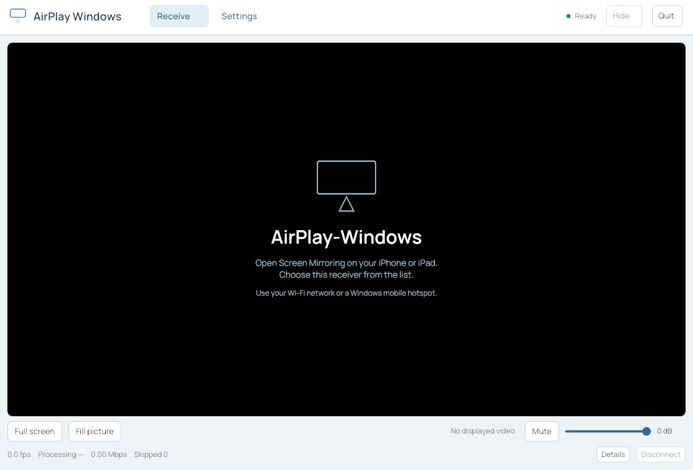

# AirPlay Windows — Iced / wgpu edition

A Rust AirPlay receiver with an Iced desktop interface, GPU YUV video rendering
and cpal/WASAPI audio. Receiving continues while its presentation window is
minimized, closed or hidden in the Windows tray. Explicit Quit shuts down the
service and its media workers.



## Features

- Existing AirPlay pairing, encrypted mirroring, RTP audio recovery and session
  replacement behavior, with generation fencing across reconnects and FLUSH.
- H.264 / HEVC decoding, including D3D11VA and NVDEC fallback paths.
- Reusable NV12 / YUV420P plane textures, GPU colour conversion, aspect fit/crop
  and full-screen presentation. No CPU YUV-to-RGBA video conversion.
- P010 / YUV420P10 Main10 input, PQ/HLG HDR to SDR tone mapping and BT.2020/P3
  gamut conversion. HDR playback uses the same shared GPU render pass.
- cpal audio output with negotiated device formats, an allocation-free application
  callback, underflow recovery and default/selected-device reconstruction.
- Separate HLS demux/audio/video scheduling, TS/fMP4 and FCUP resource delivery.
- Receiver/settings/diagnostic pages, cover art, volume, Windows tray restoration,
  startup options and persistent compatible settings.
- Recording and all related UI, configuration, encoders and output workers removed.
  Old recording configuration values are ignored; existing user files are untouched.

Video requires a compatible GPU backend. Software UI fallback supports controls
and audio but displays an explicit video limitation. 10-bit PQ/HLG video is
mapped to the current SDR window; native Windows HDR output and Dolby Vision /
HDR10+ dynamic metadata are not implemented. BT.2020 CL, 12-bit and non-420
formats remain unsupported. See [HDR rendering](docs/RUST_HDR.md). Hardware decode
still downloads to software YUV before upload: **this is not zero-copy**.

## Run

```text
airplay-windows.exe
airplay-windows.exe --hwaccel
airplay-windows.exe --start-hidden
airplay-windows.exe --headless --port 7000
```

Use the same LAN or Windows mobile hotspot, then select the receiver in your
iPhone/iPad's Screen Mirroring menu. HLS/FCUP playback can be enabled in settings.
Settings and identity use the existing application configuration directory.

F11 toggles fullscreen; Escape returns to the window. Ctrl+H hides/restores
controls, Ctrl+D disconnects and Ctrl+Q quits. The Windows tray restores/hides the presentation window,
disconnects the sender, or quits the whole application. Closing the window does
not mean quitting the receiver.

## Build, verification and delivery

See [build instructions](docs/RUST_BUILD.md), [architecture](docs/RUST_ARCHITECTURE.md),
[validation status](docs/RUST_VALIDATION.md) and [hardware acceptance](docs/RUST_ACCEPTANCE.md).
The [migration report](docs/RUST_MIGRATION_REPORT.md) lists the delivered changes,
executed regressions, package contents and remaining physical checks.
The Windows package uses audited LGPL FFmpeg DLLs, includes corresponding patched
source/build material and required notices, and is tested again with a clean PATH.
CI and manual release dispatch build the checked-out Iced implementation.

GPU readback/protocol tests do not establish real Windows/iPhone FPS, latency,
power, device hotplug or long-term AV drift. Those measurements must compare
both the C++ `562120e4` and Rust/Slint `43bcb0c` baselines on identical hardware.

## License

The project license remains unchanged pending a separate audit of the existing
Rust implementation's relationship to GPL C++ sources. Removing Slint/GPL FFmpeg
features is not itself permission to relicense existing code. Third-party license
texts and FFmpeg build/source materials accompany Windows distributions.
